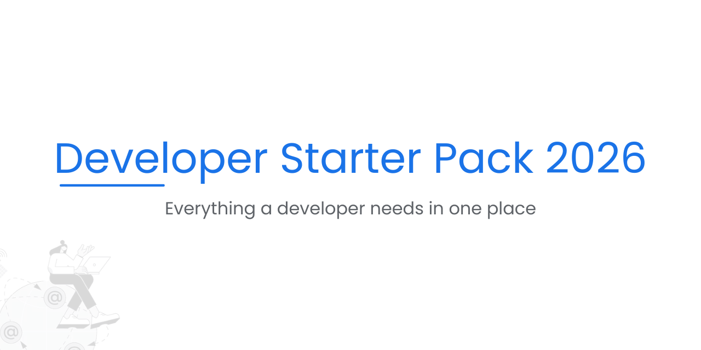

# 🚀 Developer Starter Pack 2026

Everything a developer needs in 2026.

Free tools • AI resources • Roadmaps • Project ideas • Platforms

> ⚡ Beginner-friendly • Student-approved • Updated regularly

---
 
## 📌 What is this?

This repository is a **curated collection of the best tools, resources, and platforms** every developer should know in 2026.

No installation. No setup. Just **high-quality links and guidance**.

Perfect for:

* 👨‍🎓 Students
* 👶 Beginners
* 👨‍💻 Self-taught developers
* 🚀 Anyone starting development in 2026

---

## 🧑‍💻 Developer Paths

* Frontend Developer
* Backend Developer
* Full Stack Developer
* Mobile App Developer
* UI / UX Designer
* AI / Automation Developer

---

## 🛠️ Must-Have Developer Tools

* VS Code – Code editor
* Git & GitHub – Version control
* Postman – API testing
* Figma – UI / UX design
* Chrome DevTools – Debugging

---

## ⚡ Best VS Code Extensions

* Prettier – Code formatter
* ESLint – Code quality
* Live Server – Local development
* GitLens – Git superpowers
* Error Lens – Instant error visibility

---

## 🌍 Free Hosting Platforms

* GitHub Pages – Static sites
* Vercel – Frontend apps
* Surge.sh - Frontend apps
* Netlify – JAMstack projects
* Render – Full-stack hosting
* Firebase – Backend + hosting

---

## 🤖 AI Tools for Developers (HOT 🔥)

* ChatGPT – Coding & explanations
* GitHub Copilot – AI pair programmer
* Claude – Long-form reasoning
* Perplexity – Research assistant
* Codeium – Free AI autocomplete
* Gemini - Powerful AI ( Recommended For Image Generating )

---

## 🧠 Learning Platforms

* freeCodeCamp
* MDN Web Docs
* W3Schools
* Coursera
* Udemy
* Alison

---

## 🧭 Developer Roadmaps

* Frontend Roadmap
* Backend Roadmap
* Full Stack Roadmap
* DevOps Roadmap
* Mobile Development Roadmap

Tip: Follow step-by-step, don’t rush 🚶‍♂️

---

## 🧪 Beginner Project Ideas

* Personal Portfolio Website
* To-Do App
* URL Shortener
* Weather App
* Simple Ecommerce UI
* Chat Application

---

## 📂 Recommended GitHub Repositories

* Awesome Lists
* Free Programming Books
* Public APIs
* System Design Primer

---

## 🎓 Recommended Youtube Channels

* Javascript Mastery
* GreatStack
* freecodecamp
* Codesistency

---

## 💼 Resume & Career Resources

* Resume Builders
* Interview Preparation
* Coding Challenges
* Open Source Contribution Guides

---

## ⭐ How to Support

If this repository helps you:

* ⭐ Star this repo
* 🍴 Fork it
* 🔁 Share it with friends

---

## 🙌 Contribution

Want to improve this pack?

* Fork the repo
* Add useful resources
* Open a pull request

All contributions are welcome 💙

---

## 🧑‍🎓 About

Made **for students, by a student**.

Let’s grow together in 2026 🚀
